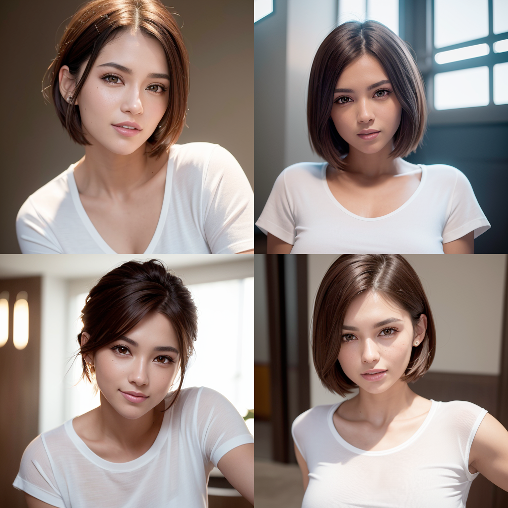
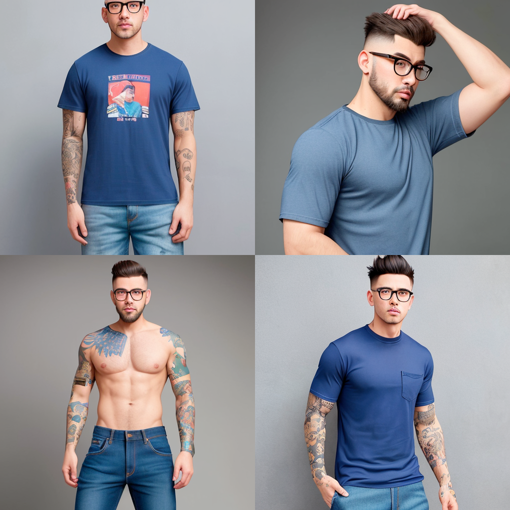

dreamlikeart, 3d render of futuristic military cyborg, cyberpunk, warframe, stealth, armored, neon lights, character design, hard surface, smooth, detailed face, highly detailed, intricate details, symmetrical, volumetric lighting, ambient light, real-time, vfx, digital 3d, uhd, hdr

Negative prompt: 

mouth, ears, holes, out of frame, bad art, blurry, bad proportions, gross proportions, duplicate, bad anatomy, deformed, ugly, long neck, cropped head, cartoon, anime, digital painting

<(masterpiece, realistic:1. 3), (extremely intricate:1. 2)>, portrait of a girl, face, close up, pointy ears, dress, half-closed eyes, jewelry, sitting, strapless, strapless dress, breasts, watermark, bare shoulders, tiara, grey dress, cleavage, long hair, braid, grey hair, long eyelashes, solo, profile, solo, elf,

Negative prompt:

(worst quality, low quality:1.4), (depth of field, blurry:1.2), (greyscale, monochrome:1.1), 3D face, cropped, lowres, text, jpeg artifacts, signature, watermark, username, blurry, artist name, trademark, watermark, title, multiple view, Reference sheet, curvy, plump, fat, muscular female, strabismus, 

 Detailed and realistic human Spaceman working on mars with a large rock formation in the background, Mars Rovers working with a habitat and other spacemen 

 Negative prompt:
nartfixer| nfixer

 an otherworldly machine that is similar in nature to a large robotic raptor, UHD, raytracing, godrays, (technical drawing:1. 1), schematic

Negative prompt: lowres, bad anatomy, bad hands, text, error, missing fingers, extra digit, fewer digits, worst quality, cropped, low quality, normal quality, jpeg artifacts, signature, watermark, username, blurry, artist name, deformed, missing limb, poorly drawn hands, floating limbs, malformed hands, out of frame, malformed eyes, bad lighting, cloned face, fused fingers, gross proportions, long neck, mutilated, mutated hands, warped face, tiling, two mouths connected, two heads connected, floating weapons, floating limbs

ClosClose-up photo of a beautiful model girl, brown eyes, wearing a white t-shirt, photorealistic, high contrast, 8k HD, detailed, hyper-detailed, realistic skin texture, best quality, ultra high res, raw photo, dramatic lighting, unreal engine, smiling, short hairs, e-up photo of a beautiful model girl, brown eyes, wearing a white t-shirt, photorealistic, high contrast, 8k HD, detailed, hyper-detailed, realistic skin texture, best quality, ultra high res, raw photo, dramatic lighting, unreal engine, smiling, short hairs

**Negative prompt:**

paintipaintings, sketches, (worst quality:2) , (low quality:2) , (normal quality:2) , lowres, normal quality, ((monochrome) ), ((grayscale) ), skin spots, acnes, skin blemishes, bad anatomy, (long hair:1.4) , DeepNegative, (fat:1.2) , facing away, looking away, tilted head, {Multiple people} , lowres, bad anatomy, bad hands, text, error, missing fingers, extra digit, fewer digits, cropped, worstquality, low quality, normal quality, jpegartifacts, signature, watermark, username, blurry, bad feet, cropped, poorly drawn hands, poorly drawn face, mutation, deformed, worst quality, low quality, normal quality, jpeg artifacts, signature, watermark, extra fingers, fewer digits, extra limbs, extra arms, extra legs, malformed limbs, fused fingers, too many fingers, long neck, cross-eyed, mutated hands, polar lowres, bad body, bad proportions, gross proportions, text, error, missing fingers, missing arms, missing legs, extra digit, extra arms, extra leg, extra foot, nsfwngs, sketches, (worst quality:2) , (low quality:2) , (normal quality:2) , lowres, normal quality, ((monochrome) ), ((grayscale) ), skin spots, acnes, skin blemishes, bad anatomy, (long hair:1.4) , DeepNegative, (fat:1.2) , facing away, looking away, tilted head, {Multiple people} , lowres, bad anatomy, bad hands, text, error, missing fingers, extra digit, fewer digits, cropped, worstquality, low quality, normal quality, jpegartifacts, signature, watermark, username, blurry, bad feet, cropped, poorly drawn hands, poorly drawn face, mutation, deformed, worst quality, low quality, normal quality, jpeg artifacts, signature, watermark, extra fingers, fewer digits, extra limbs, extra arms, extra legs, malformed limbs, fused fingers, too many fingers, long neck, cross-eyed, mutated hands, polar lowres, bad body, bad proportions, gross proportions, text, error, missing fingers, missing arms, missing legs, extra digit, extra arms, extra leg, extra foot, nsfw

 photograph, front view, professional model, man, shaved hair and neat beard with horn-rimmed glasses, standing on solid grey background photo studio, gaze into the camera, wrinkles on the forehead, by Son Goku  style photo, used camera is Sony α9 II with Sony FE 100-400mm f/4. 5-5. 6 GM OSS lens, wearing left chest big pocket with small logo blank, deep dark blue color loose XL T-shirt, tattoo on the arm, deep washing denim minimal innovative design jogger pants, model is expressed in photography, high contrast --ar 9:16 --style raw --stylize 700 --v 6 
 
**Negative prompt:**
 --no unfinished forms, awkward pose, strange tags and logos, typo, many legs, extra hands, unrealism, unfocused eye, monochrome photograph 